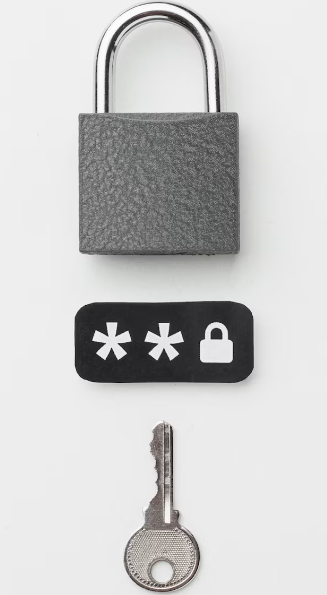

# Privacidad Asombrosa (v. en Español)

El archivo en inglés está licenciado bajo CC0-1.0 por Alicia Sykes (2019-2024) en el repositorio: [awesome-privacy](https://github.com/Lissy93/awesome-privacy)

A continuación, se presenta el contenido del archivo YAML reformulado en formato Markdown, con descripciones, menciones notables, advertencias y ediciones del editor.

**Nota**:
El contenido sigue en proceso. Cualquier contribución es bienvenida. 

## Alternativas populares a evitar:
- Gestores de contraseñas: LastPass, 1Password, Dashlane, NordPass, RoboForm.
- Autenticación de 2 factores: Google Authenticator, Authy, Microsoft Authenticator, LastPass Authenticator, Duo Mobile.
- Encriptación de archivos: BitLocker, FileVault, AxCrypt, WinRAR.
- Navegadores: Chrome, Safari, Firefox, Edge, Opera.
- Motores de búsqueda: Google, Bing, Yahoo, Baidu, Yandex.

## Categorías

### Esenciales

Herramientas básicas para la privacidad: gestores de contraseñas, autenticación de dos factores, encriptación de archivos, navegadores y motores de búsqueda.

#### Gestores de Contraseñas

- **[Bitwarden](https://bitwarden.com/es-la/)**: Código abierto con sincronización en la nube, fácil de usar, apps para escritorio, web y móvil. Considera Vaultwarden para autoalojamiento.
- **[KeePass](https://keepass.info/)**: Gestor endurecido, seguro y offline, sin sincronización integrada. Estándar de oro. Clientes: Strongbox (Mac/iOS), KeePassDX (Android), KeeWeb (web), KeePassXC (Windows/Mac/Linux).
- **[LessPass](https://lesspass.com/)**: Genera contraseñas con hash de sitio, usuario y master password. Sin almacenamiento. Autoalojable, apps multiplataforma.
- **[Padloc](https://padloc.app/)**: Moderno, código abierto para individuos/equipos. Intuitivo, apps para todas plataformas, autoalojable.
- **[ProtonPass](https://proton.me/es-419/pass)**: De ProtonMail, apps nativas, plan gratuito. Proveedor confiable.
- **[Pass](https://www.passwordstore.org/)**: Estándar Unix, código abierto.

**Menciones notables**:
- PassBolt: Gratuito, código abierto, autoalojado, ideal para equipos, integraciones (Docker).
- 1Password: Propietario, sincronización multiplataforma, auditorías regulares ($3/mes alojado).
- Otros: Buttercup, Clipperz, TeamPass, PSONO, UPM, Gorilla, Seahorse (GNOME), GNOME Keyring, KDE Wallet Manager.

**Advertencia**: Si usas obsoletos como Firefox Lockwise, Encryptr, Mitro, etc., migra a algo en local.

#### Autenticación de 2 Factores

- **[2FAS](https://2fas.com/)**: Gratuita, código abierto para iOS/Android, backups encriptados, sincronización sin cuenta.
- **[Aegis](https://getaegis.app/)**: Gratuita, código abierto para Android, backups, modo oscuro.
- **[Stratum](https://stratumauth.com/)**: Gratuita, código abierto para Android, backups encriptados, íconos, Wear OS.
- **[Tofu](https://www.tofuauth.com/)**: Fácil, código abierto para iOS.
- **[Authenticator](https://mattrubin.me/authenticator/)**: Simple, nativo, código abierto para iOS, sin internet.
- **[WinAuth](https://winauth.github.io/winauth/)**: Portátil, encriptada para Windows, código abierto desde 2010.
- **[Authenticator GNOME](https://gitlab.gnome.org/World/Authenticator)**: Basado en Rust, integración GNOME, en Flathub.
- **[Authenticator CC](https://authenticator.cc/)**: Extensión navegador para OTP (TOTP/HOTP).
- **[Ente Auth](https://ente.io/auth/)**: Gratuita, código abierto, TOTP con sincronización encriptada u offline.

Verifica sitios en [2fa.directory](https://2fa.directory).

**Menciones**: OTPClient (Linux), gauth (web autoalojado), Etopa (Android), TrayTop (KeePass, offline multiplataforma).

#### Encriptación de Archivos

- **[VeraCrypt](https://www.veracrypt.fr)**: Código abierto multiplataforma para archivos/discos, rico en funciones, CLI/portátil (sucesor TrueCrypt).
- **[Cryptomator](https://cryptomator.org/)**: Encriptación cliente para nube, preserva estructura, apps móviles (Windows/Linux/Mac).
- **Age**: CLI simple, moderna, segura con claves pequeñas, estilo UNIX.
- **Picocrypt**: Pequeña, simple, enfocada en seguridad y confiabilidad.

**Advertencia**: Elige multiplataforma; contraseñas débiles o malware comprometen seguridad. Sigue prácticas básicas.

**Menciones**:
- AES Crypt: Ligera, apps multiplataforma (problemas de seguridad pasados).
- CryptSetup: Capa sobre dm-crypt.
- EncFS: Multiplataforma para directorios.
- geli: Para FreeBSD.
- BitLocker: Rápido para Windows (no código abierto, defectos).
- FileVault: Fácil para MacOS (propietario).
- DiskCryptor: Código abierto para Windows (alternativa BitLocker).

#### Navegadores

- **[LibreWolf](https://librewolf.net/)**: Fork Firefox con privacidad predeterminada, sin telemetría, uBlock Origin, basado en Arkenfox.
- **[Brave Browser](https://brave.com/es/)**: Rápido, bloquea rastreadores, Tor integrado, paga en BAT.
- **[Firefox](https://www.firefox.com/es-MX/)**: Más privado que Chrome; ajusta con user.js de Arkenfox o guías de Restore Privacy/12Bytes.
- **Tor Browser**: Anonimato vía nodos, lento, compromisos.
- **Cromite**: Fork Chromium con bloqueo anuncios, privacidad (basado Bromite).

**Móviles notables**: Mull (Android), Firefox Focus (Android/iOS), DuckDuckGo Browser (Android/iOS), Orbot + Tor (Android), Onion Browser (iOS), Vanadium (GraphenOS).

**Advertencia**: Ajusta privacidad post-instalación (ver guía Firefox en 12Bytes).

#### Motores de Búsqueda

- **[DuckDuckGo](https://duckduckgo.com/)**: Sin rastreadores/cookies/anuncios, personalizable, .onion, sin JS.
- **[Qwant](https://www.qwant.com/)**: Agrega Bing + propios, sin cookies/rastreadores, no sesgados.
- **[Startpage](https://www.startpage.com/es/)**: Busca Google, reorganiza con privacidad (no código abierto).
- **[Brave](https://brave.com/es/)**: Sin rastreo, índice propio, sin algoritmos secretos.
- **[Mojeek](https://www.mojeek.com/)**: Resultados independientes, cero rastreo (no código abierto).

**Menciones**: MetaGear, YaCy, Searx (autoalojables, instancias en searx.space); SearxNG (fork).

### Comunicación

Categoría con mensajería encriptada, P2P, email encriptado, clientes de email, reenvío de email, herramientas de seguridad de email, clientes VOIP, números de teléfono virtuales y colaboración en equipo.

Alternativas populares a **EVITAR**:

- Mensajería: WhatsApp, Facebook Messenger, WeChat, Telegram, Snapchat, Viber, Line, Discord.
- Email: Gmail, Outlook, Yahoo Mail, iCloud Mail, AOL Mail, Zoho Mail.
- Clientes de email: Microsoft Outlook, Apple Mail, eM Client, Mailbird, Postbox.
- VOIP: Skype, Zoom, Google Meet, Microsoft Teams, Cisco Webex, Gotomeeting.
- Números virtuales: Google Voice, Grasshopper, RingCentral, Sideline, Burner.
- Colaboración: Slack, Microsoft Teams, Google Chat, Discord, Asana, Trello, Basecamp.

#### Mensajería Encriptada

- **[Signal](https://signal.org/es/)**: Encriptación fuerte (Protocolo Signal), multimedia, llamadas, multiplataforma, código abierto. Probablemente una de las apps de mensajería privada más populares y seguras que combina encriptación fuerte (ver [Protocolo Signal](https://en.wikipedia.org/wiki/Signal_Protocol)) con una interfaz simple y muchas funciones. Es ampliamente usada en todo el mundo, y fácil de usar, funcionando similar a WhatsApp - con mensajería instantánea, recibos de lectura, soporte para adjuntos multimedia y permite llamadas de voz y video de alta calidad. Es multiplataforma, de código abierto y totalmente gratuita. Signal es [recomendado](https://twitter.com/Snowden/status/661313394906161152) por Edward Snowden, y es una solución perfecta para la mayoría de usuarios.
- **[Session](https://getsession.org/)**: Session es un fork de Signal, sin embargo, a diferencia de Signal, no requiere un número de móvil (ni ningún otro dato personal) para registrarse, en su lugar cada usuario es identificado por una clave pública. Es descentralizado, con servidores administrados por la comunidad a través de [Loki Net](https://loki.network), los mensajes se encriptan y enrutan a través de varios de estos nodos. Todas las comunicaciones son E2E encriptadas, y no hay metadatos.
- **[SimpleX](https://simplex.chat/es/)**: SimpleX está ganando popularidad como una app de mensajería segura y privada conocida por su robusto protocolo de encriptación sin IDs de usuario ni números de teléfono, lo que mejora tu privacidad. SimpleX ofrece mensajería instantánea, soporta adjuntos multimedia y llamadas de voz y video. Además, es multiplataforma, de código abierto y completamente gratuita, alineándose con las preferencias modernas de conveniencia, seguridad y accesibilidad. Aprende más sobre la [Política de Seguridad](https://simplex.chat/security/)
- **[XMPP](https://xmpp.org/)**: XMPP, también conocido como Jabber, es un estándar abierto para mensajería descentralizada que ha sido ampliamente usado por décadas. De hecho, ha sido la base sobre la que se construyeron WhatsApp, el Chat de Facebook y Talk de Google, pero estas compañías (eventualmente) eligieron eliminar la interoperabilidad con otros servidores. Clientes XMPP prominentes soportan [OMEMO end-to-end encryption](https://en.wikipedia.org/wiki/OMEMO), que se basa en el [Algoritmo Double Ratchet](https://en.wikipedia.org/wiki/Double_Ratchet_Algorithm) usado en Signal. Para más información práctica y registrar una cuenta, puedes visitar [JoinJabber](https://joinjabber.org).
- **[Matrix](https://matrix.org/)**: Matrix es una red abierta descentralizada para comunicaciones seguras, con E2E encriptación con Olm y Megolm. Junto con el cliente [Element](https://element.io/), soporta llamadas VOIP + video y mensajería instantánea + chats grupales. Dado que Matrix tiene una especificación abierta y una API RESTful HTTP/JSON pragmática simple, facilita la integración con IDs de terceros existentes para autenticar y descubrir usuarios, así como construir apps sobre ella.

**Menciones**: Chat Secure, KeyBase (no actualizado desde 2020); OpenPGP (para email, no fácil para principiantes).

**Advertencia**: Apps como WhatsApp/Telegram/Threema no son código abierto; no uses para datos sensibles. 

#### Mensajería P2P

Con redes [Peer-to-Peer](https://en.wikipedia.org/wiki/Peer-to-peer), no hay servidor central, así que no hay nada que pueda ser allanado, apagado o forzado a entregar datos. Hay redes P2P disponibles que son de código abierto, E2E encriptadas, enrutadas a través de servicios Tor, totalmente anónimas y operan sin recolección de metadatos.

- **[Briar](https://briarproject.org/)**: P2P vía Tor para Android, Bluetooth/WiFi sin internet.
- **[Ricochet Refresh](https://www.ricochetrefresh.net/)**: Tor para escritorio, sin servidores.
- **[Jami](https://jami.net/)**: P2P encriptada, apps GNU para audio/video/conferencias.
- **[Tox/qTox](https://tox.chat/)**: Red distribuida encriptada, clientes escritorio/móvil.

**Menciones**: Cwtch, BitMessage, RetroShare.

**Menciones notables**:
- Chat Secure
- KeyBase: Permite chat en tiempo real encriptado, chats grupales, y compartir archivos públicos y privados. También tiene funciones útiles para probar identidades sociales criptográficamente, y facilita firmar, encriptar y desencriptar mensajes con PGP. Sin embargo, desde que fue [adquirido por Zoom](https://keybase.io/blog/keybase-joins-zoom) en 2020, ya no recibe actualizaciones regulares.
- OpenPGP: Puede usarse sobre redes de chat existentes (como email o foros). Proporciona privacidad criptográfica y autenticación, PGP se usa para encriptar mensajes. **Nota/ Problemas con PGP** PGP [no es fácil](https://restoreprivacy.com/let-pgp-die/) de usar para principiantes, y podría llevar a errores humanos/ equivocaciones, lo que sería mucho peor que usar un sistema alternativo más simple. No uses [IDs de clave de 32 bits](https://evil32.com/) - son demasiado cortos para ser seguros. También se han encontrado vulnerabilidades en OpenPGP y S/MIME, definidas en [EFAIL](https://efail.de/), así que aunque se considera seguro para uso general, para chat general, podría ser mejor usar una app de mensajería o email encriptada en su lugar.

**Advertencia**: Muchas apps de mensajería afirman ser seguras, pero si no son de código abierto, esto no puede verificarse - y **no deberían confiarse**. Esto aplica a [Telegram](https://telegram.org), [Threema](https://threema.ch), [Cypher](https://www.goldenfrog.com/cyphr), [Wickr](https://wickr.com/), [Silent Phone](https://www.silentcircle.com/products-and-solutions/silent-phone/) y [Viber](https://www.viber.com/), por nombrar algunos - estas apps no deberían usarse para comunicar datos sensibles. [Wire](https://wire.com/) también ha sido removido, debido a una [adquisición reciente](https://blog.privacytools.io/delisting-wire/).

#### Email Encriptado

El email no es seguro - tus mensajes pueden ser fácilmente interceptados y leídos. Las corporaciones escanean el contenido de tu correo para construir un perfil tuyo, ya sea para mostrarte anuncios dirigidos o venderlo a terceros. A través del [Programa Prism](https://en.wikipedia.org/wiki/PRISM_(surveillance_program)), el gobierno también tiene acceso completo a tus emails (si no están encriptados de extremo a extremo) - esto aplica a Gmail, Outlook Mail, Yahoo Mail, GMX, ZoHo, iCloud, AOL y más.

Para una comparación más detallada de proveedores de email, ver [email-comparison.as93.net](https://email-comparison.as93.net/)

- **[ProtonMail](https://proton.me/mail)**: Un servicio de email anónimo encriptado de extremo a extremo. ProtonMail tiene una interfaz moderna fácil de usar y personalizable, así como apps móviles nativas rápidas y seguras. ProtonMail tiene todas las funciones que esperarías de un servicio de email moderno y se basa en simplicidad sin sacrificar seguridad. Tiene un plan gratuito o una opción premium para usar dominios personalizados (desde $5/mes). ProtonMail no requiere información personal identificable para registrarse, tienen un servidor [.onion](https://protonirockerxow.onion) para acceso vía Tor, y aceptan pagos anónimos: BTC y efectivo (así como tarjeta de crédito y PayPal normales).
- **[Tuta](https://tuta.com/es)**: Servicio de email gratuito y de código abierto basado en Alemania. Tiene una interfaz básica intuitiva, apps móviles seguras nativas y clientes de email de escritorio, registro anónimo y un calendario encriptado. Tuta tiene un plan completo gratuito y planes de suscripción premium que permiten dominios personalizados (desde $3/mes). Tuta [no usa OpenPGP](https://tuta.com/blog/posts/differences-email-encryption/) como otros proveedores de email encriptado, en su lugar usan un método estandarizado híbrido consistente en algoritmos simétricos y asimétricos (con AES256, y RSA 2048 o ECC (x25519) y Kyber-1024). Esto causa problemas de compatibilidad al comunicarse con contactos usando PGP. Pero permite encriptar mucho más de los datos de cabecera (cuerpo, adjuntos, líneas de asunto y nombres de remitentes, etc.) que los proveedores PGP no pueden hacer. Las actualizaciones recientes al algoritmo de encriptación de Tuta hacen que los datos almacenados y enviados con su servicio sean seguros contra ataques planteados por computadoras cuánticas.
- **[Forward Email](https://forwardemail.net/es)**: Un servicio de email encriptado, enfocado en privacidad y de código abierto que soporta SMTP, IMAP y acceso API.
- **[Mailfence](https://mailfence.com/?src=digitald)**: Mailfence soporta OpenPGP para que puedas intercambiar claves de encriptación manualmente independientemente de los servidores de Mailfence, poniéndote en control total. Mailfence tiene una interfaz simple, similar a la de Outlook, y viene con calendario, libreta de direcciones y archivos integrados. Todas las configuraciones de email son altamente personalizables, pero claras y fáciles de usar. El registro no es anónimo, ya que se requiere tu nombre y dirección de email previa. Hay un plan completamente funcional gratuito, o puedes pagar por premium y usar un dominio personalizado ($2.50/mes, o $7.50/mes para 5 dominios), donde se acepta Bitcoin, LiteCoin o tarjeta de crédito.
- **[MailBox.org](https://mailbox.org/)**: Un proveedor de email seguro basado en Berlín, ecológico. No hay plan gratuito, el servicio estándar cuesta €12/año. Puedes usar tu propio dominio, con la opción de un [alias catch-all](https://kb.mailbox.org/display/MBOKBEN/Using+catch-all+alias+with+own+domain). Proporcionan buena seguridad de cuenta y encriptación de email, con OpenPGP, así como almacenamiento encriptado. No hay app dedicada, pero funciona bien con cualquier cliente de email estándar con SSL. Actualmente no hay opción de pago anónimo.

**Menciones notables**:
- HushMail
- Soverin
- StartMail
- Posteo
- Disroot

**Advertencia**:
- Al usar una tecnología de encriptación de extremo a extremo como OpenPGP, algunos metadatos en la cabecera del email no se encriptarán.
- OpenPGP tampoco soporta Forward secrecy, lo que significa que si tu clave privada o la del destinatario es robada alguna vez, todos los mensajes previos encriptados con ella serán expuestos. Debes tener gran cuidado para mantener seguras tus claves privadas.

#### Clientes de Email

Los clientes de email son los programas usados para interactuar con el servidor de email. Para email alojado, las interfaces web y móviles proporcionadas por tu servicio de email suelen ser adecuadas, y podrían ser la opción más segura. Para email autoalojado, necesitarás instalar y configurar clientes de email para web, escritorio o móvil. Un beneficio de usar un cliente IMAP es que siempre tendrás una copia de seguridad offline de todos los mensajes de email (que luego pueden encriptarse y archivarse), y muchas aplicaciones te permiten agregar múltiples buzones para conveniencia. Los clientes de email de escritorio no son vulnerables a los ataques comunes de navegador que sus contrapartes web sí lo son.

- **[Mozilla Thunderbird](https://www.thunderbird.net/es-ES/)**: Aplicación de email gratuita y de código abierto desarrollada y respaldada por Mozilla - es segura, privada, fácil y personalizable. A partir de V 78.2.1, la encriptación está integrada, y la extensión [TorBirdy](https://trac.torproject.org/projects/tor/wiki/torbirdy) enruta todo el tráfico a través de la red Tor. Forks como [Betterbird](https://github.com/Betterbird/thunderbird-patches) podrían agregar funciones adicionales.
- **[eM Client](https://www.emclient.com/)**: Cliente de email basado en productividad, para Windows y MacOS. eM Client tiene una interfaz de usuario limpia, rendimiento rápido y buena compatibilidad. Hay una versión paga, con algunas funciones útiles, incluyendo posponer emails entrantes, vigilar respuestas para un hilo específico, traducción de mensajes, enviar después, y Calendario, Tareas, Contactos y Notas integrados. Nota, eM Client es propietario, no de código abierto.
- **[SnappyMail](https://snappymail.eu/)**: Cliente de email web simple, moderno y rápido. Es un fork solo IMAP de [RainLoop](http://www.rainloop.net) que mitiga una severa [vulnerabilidad de RainLoop](https://thehackernews.com/2022/04/unpatched-bug-in-rainloop-webmail-could.html) y agrega varias nuevas [funciones](https://snappymail.eu/comparison).
- **[RoundCube](https://roundcube.net/)**: Cliente IMAP multilingüe basado en navegador con una interfaz de usuario similar a una aplicación. Proporciona toda la funcionalidad que esperarías de un cliente de email, incluyendo soporte MIME, libreta de direcciones, manipulación de carpetas, búsqueda de mensajes y corrección ortográfica.
- **[FairEmail](https://email.faircode.eu/)**: Cliente de email de código abierto, con todas las funciones y fácil para Android. Soporta cuentas ilimitadas y direcciones de email con la opción de una bandeja de entrada unificada. Interfaz de usuario limpia, con opción de modo oscuro, es también muy ligero y consume uso mínimo de datos.
- **[K-9 Mail](https://k9mail.app/)**: K-9 (o Thunderbird para Android) es de código abierto, muy bien soportado y confiable - k9 ha existido casi tanto como Android mismo! Soporta múltiples cuentas, búsqueda, email push IMAP, sincronización multi-carpeta, marcado, archivo, firmas, BCC-self, PGP/MIME y más. Instala OpenKeychain junto a él, para encriptar/desencriptar emails usando OpenPGP.

**Advertencia**: Una desventaja de los clientes de email es que muchos no soportan 2FA, así que es importante mantener tu dispositivo seguro y encriptado.

**Menciones notables**: Si estás usando ProtonMail, entonces el [ProtonMail Bridge](https://protonmail.com/bridge/thunderbird) te permite sincronizar y respaldar tus emails a tu propio cliente de email de escritorio. Funciona bien con Thunderbird, Microsoft Outlook y otros.

#### Reenvío de Email

Revelar tu dirección de email real en línea puede ponerte en riesgo. El aislamiento de email permite que los mensajes enviados a [quiensea]@un-dominio.com lleguen a tu bandeja principal. Esto protege tu dirección de email real de ser revelada. Los aliases se generan automáticamente la primera vez que se usan. Este enfoque te permite identificar qué proveedor filtró tu dirección de email, y bloquear un alias con un clic.

- **[Addy](https://addy.io/)**: Un servicio de reenvío de email anónimo de código abierto, que te permite crear aliases de email ilimitados. Tiene un plan gratuito.
- **[33Mail](https://33mail.com/)**: Un servicio de aliasing de larga data. Además de recibir, 33Mail también te permite responder a direcciones reenviadas de manera anónima. Plan gratuito, así como plan Premium ($1/mes) si quieres usar un dominio personalizado. Nota que 33Mail usa Google Analytics.
- **[SimpleLogin](https://simplelogin.io/)**: Servicio de alias completamente de código abierto (ver en [GitHub](https://github.com/simple-login)) con muchas funciones adicionales. Puede autoalojarse, o la versión gestionada tiene un plan gratuito, así como opción premium alojada ($2.99/mes) para usar dominios personalizados.
- **[Firefox Private Relay](https://relay.firefox.com/)**: Desarrollado y gestionado por Mozilla, Relay es un addon de Firefox que te permite hacer un alias de email con 1 clic, y tener todos los mensajes reenviados a tu email personal. Relay es totalmente gratuito de usar, y muy accesible para usuarios menos experimentados, pero también [de código abierto](https://github.com/mozilla/fx-private-relay), y capaz de autoalojarse para uso avanzado.
- **[ForwardEmail](https://forwardemail.net/es)**: Servicio de reenvío de email catch-all de código abierto simple. Fácil de autoalojar (ver en [GitHub](https://github.com/forwardemail/free-email-forwarding)), o la versión alojada tiene un plan gratuito así como un plan premium ($3/mes).
- **ProtonMail**: Si ya tienes el paquete, entonces una implementación de esta función está disponible.

#### Herramientas de Seguridad de Email

- **[Enigmail](https://www.enigmail.net/index.php/en/)**: Add-on para cliente de email, que habilita el uso de OpenPGP para encriptar, desencriptar fácilmente, verificar y firmar emails. Gratuito y de código abierto, Enigmail es compatible con Interlink Mail & News y Postbox. Su sitio web contiene documentación exhaustiva y guías de inicio rápido, una vez configurado es extremadamente conveniente de usar.
- **[Email Privacy Tester](https://www.emailprivacytester.com/)**: Herramienta rápida que te permite probar si tu cliente de email "lee" tus emails antes de que los abras, y también verifica qué analíticas, recibos de lectura u otros datos de rastreo permite que se envíen de vuelta al remitente. El sistema es de código abierto ([en GitLab](https://gitlab.com/mikecardwell/ept3)), desarrollado por [Mike Cardwell](https://www.grepular.com/) y confiable, pero si no quieres usar tu email real, crear una segunda cuenta con el mismo proveedor debería dar resultados idénticos.
- **[DKIM Verifier](https://addons.thunderbird.net/en-US/thunderbird/addon/dkim-verifier/?collection_id=a5557f08-eafd-7a39-81c6-09127da790f7)**: Verifica firmas DKIM y muestra el resultado en la cabecera del email, para ayudar a detectar emails spoofed (que no vienen del dominio que afirman).

**Menciones notables**: Si estás usando ProtonMail, entonces el [ProtonMail Bridge](https://protonmail.com/bridge/thunderbird) te permite sincronizar y respaldar tus emails a tu propio cliente de email de escritorio. Funciona bien con Thunderbird, Microsoft Outlook y otros.

#### Clientes VOIP

- **[Mumble](https://www.mumble.info/)**: Software de chat de voz de código abierto, de baja latencia y alta calidad. Puedes alojar tu propio servidor, o usar una instancia alojada, hay aplicaciones cliente para Windows, MacOS y Linux, así como apps de terceros para Android e iOS.
- **[Linphone](https://www.linphone.org/home/)**: Grupos de IM, video y audio de código abierto con E2E encriptación y servidor de medios integrado. Basado en [SIP](https://en.wikipedia.org/wiki/Session_Initiation_Protocol)- evolucionando a [RCS](https://en.wikipedia.org/wiki/Rich_Communication_Services). Apps nativas para Android, iOS, Windows, GNU/Linux y MacOS.

**Menciones notables**:
- SpoofCard: Te permite hacer llamadas anónimas + voicemail, pero no es de código abierto y hay información limitada sobre seguridad (evita enviar info segura).
- MicroSip: Un softphone SIP portátil de código abierto para Windows basado en pila PJSIP.

#### Números de Teléfono Virtuales

- **SMSPool**: ¿No te sientes cómodo dando tu número de teléfono? Protege tu identidad en línea usando nuestros números de teléfono no-VoIP de un solo uso. Soportamos más de 50+ países y más de 300+ servicios.
- **Silent.link**: eSIM anónima para enviar/recibir SMS, llamadas entrantes e internet 4G/5G + roaming mundial. No se requieren datos al registrarse. Precios asequibles, con pagos y recargas aceptados en BTC. Requiere un dispositivo compatible con eSim.
- **Crypton.sh**: Tarjeta SIM física en la nube, para enviar + recibir mensajes SMS. Los mensajes se encriptan usando tu clave privada elegida. Incluye una interfaz web, así como una API para interactuar desde cualquier dispositivo. Precio alrededor de €7.00/mes, y se aceptan pagos en BTC, XMR o tarjeta de crédito.
- **Jmp.chat**: Número de teléfono para llamadas entrantes + salientes y mensajes, proporcionado por Soprani. Funciona con Jabber, Matrix, Snikket, XMPP o cualquier cliente SIP. Precio desde $4.99/mes. Solo disponible en EE.UU. y Canadá (a partir de 2024). Ver instancias alternativas en [soprani.ca](https://soprani.ca/).
- **MoneroSMS**: Servicio SMS anónimo capaz de activar cuentas. Accesible vía web, CLI o email. Precio desde $3.60/mes. El servicio está en beta a partir de 2022.

#### Colaboración en Equipo

Ahora más que nunca dependemos de software para ayudar con la colaboración en equipo. Desafortunadamente, muchas opciones populares, como [Slack](https://www.wired.co.uk/article/slack-privacy-settings-notifications), [Microsoft Teams](https://www.wired.co.uk/article/microsoft-teams-meeting-data-privacy), [Google for Work](https://www.wired.com/story/google-tracks-you-privacy/) y [Discord](https://cybernews.com/privacy/discord-privacy-tips-that-you-should-use-in-2020/) vienen con serias implicaciones de privacidad. Funciones típicas de software de colaboración en equipo incluyen: mensajería instantánea, mensajería grupal cerrada y abierta, llamadas de conferencia de voz y video, compartir archivos/ drop de archivos, y algún nivel de funcionalidad de programación.

- **[Rocket.Chat](https://www.rocket.chat/)**: Plataforma de colaboración en equipo fácil de desplegar y autoalojada con apps cliente multiplataforma estables y ricas en funciones. La interfaz es rápida, atractiva e intuitiva, así que se necesita muy poca experiencia técnica para los usuarios de la plataforma. El conjunto de funciones de Rocket.Chat es similar al de Slack, lo que lo hace un buen reemplazo para cualquier equipo que busque mayor control sobre sus datos.
- **[RetroShare](https://retroshare.cc/)**: Comunicaciones grupales seguras, con la opción de usarse sobre Tor o I2P. Chats grupales e individuales rápidos e intuitivos con texto y medios ricos usando salas de chat descentralizadas, con una función de correo para entregar mensajes a contactos offline. Una función de canales permite a miembros de diferentes equipos mantenerse actualizados entre sí, y compartir archivos. También incluye foros integrados, agregación de enlaces, compartir archivos y llamadas de voz y video. RetroShare es un poco más complejo de usar que algunas alternativas, y la interfaz es bastante *retro*, así que podría no ser apropiado para un equipo no técnico.
- **[Element](https://element.io/)**: Mensajero enfocado en privacidad usando el protocolo Matrix. El cliente Element permite salas de chat grupal, compartir medios y llamadas grupales de voz y video.
- **Internet Relay Chat**: Una solución basada en IRC es otra opción, siendo descentralizada no hay punto de fallo, y es fácil de autoalojar. Sin embargo, es importante tener en mente la seguridad mientras configuras tu instancia IRC y asegurar que los canales estén correctamente encriptados - IRC tiende a ser mejor para comunicaciones abiertas. Hay una variedad de clientes para elegir - opciones populares incluyen: The Lounge (basado en web), HexChat (Linux), Pidgin (Linux), WeeChat (Linux, basado en terminal), IceChat (Windows), XChat Aqua (MacOS), Palaver (iOS) y Revolution (Android).

**Menciones notables**: Algunas plataformas de chat permiten chats grupales multiplataforma, conferencias de voz y video, pero sin las funciones adicionales de colaboración. Por ejemplo, [Tox](https://tox.chat/), [Session](https://getsession.org/), [Ricochet](https://ricochet.im/), [Mumble](https://www.mumble.info/) y [Jami](https://jami.net/). Para Conferencias, [OSEM](https://osem.io) es una herramienta de gestión de conferencias todo en uno de código abierto, proporcionando Registro, Horarios, Sesiones en Vivo y Grabadas, Envíos de Papers, Páginas de Marketing y Administración.

### Herramientas de Seguridad

#### Extensiones de Navegador

Las siguientes extensiones de navegador te dan mejor control sobre qué contenido puede cargarse y ejecutarse mientras navegas. Antes de instalar nada, deberías leer la sección de Advertencia a continuación.

- **Privacy Badger**: Bloquea rastreadores invisibles, para detener a anunciantes y terceros de rastrear secretamente dónde vas y qué páginas ves. **Descarga**: [Chrome](https://chrome.google.com/webstore/detail/privacy-badger/pkehgijcmpdhfbdbbnkijodmdjhbjlgp) - [Firefox](https://addons.mozilla.org/en-GB/firefox/addon/privacy-badger17/).
- **uBlock Origin**: Bloquea anuncios, rastreadores y sitios de malware. **Descarga**: [Chrome](https://chrome.google.com/webstore/detail/ublock-origin/cjpalhdlnbpafiamejdnhcphjbkeiagm?hl=en-GB) - [Firefox](https://addons.mozilla.org/en-GB/firefox/addon/ublock-origin/).
- **ScriptSafe**: Te permite bloquear la ejecución de ciertos scripts. **Descarga**: [Chrome](https://chromewebstore.google.com/detail/scriptsafe/oiigbmnaadbkfbmpbfijlflahbdbdgdf) - [Opera](https://addons.opera.com/en/extensions/details/scriptsafe-2/).
- **Firefox Multi-Account Containers**: Firefox Multi-Account Containers te permite mantener partes de tu vida en línea separadas en pestañas codificadas por color que preservan tu privacidad. Las cookies se separan por contenedor, permitiéndote usar la web con múltiples identidades o cuentas simultáneamente. **Descarga**: [Firefox](https://addons.mozilla.org/en-US/firefox/addon/multi-account-containers/).
- **WebRTC-Leak-Prevent**: Proporciona control al usuario sobre configuraciones de privacidad de WebRTC en Chromium, para prevenir fugas de WebRTC. **Descarga**: [Chrome](https://chrome.google.com/webstore/detail/webrtc-leak-prevent/eiadekoaikejlgdbkbdfeijglgfdalml?hl=en-GB). Para usuarios de Firefox, puedes hacerlo a través de [configuraciones del navegador](https://www.privacytools.io/browsers/#webrtc). Prueba fugas de WebRTC con [browserleaks.com/webrtc](https://browserleaks.com/webrtc).
- **Canvas Fingerprint Blocker**: Bloquea huellas dactilares sin remover acceso al elemento Canvas de HTML5. Las huellas dactilares de Canvas se usan comúnmente para rastreo, esta extensión ayuda a mitigar esto permitiendo que el navegador genere una clave única verdadera **Descarga**: [Chrome](https://chrome.google.com/webstore/detail/canvas-blocker-fingerprin/nomnklagbgmgghhjidfhnoelnjfndfpd) - [Firefox](https://addons.mozilla.org/en-US/firefox/addon/canvas-blocker-no-fingerprint/) - [Edge](https://microsoftedge.microsoft.com/addons/detail/ahiddppepedlomdleppkbljnmkchlmdc).
- **ClearURLs**: Esta extensión removerá automáticamente elementos de rastreo de los parámetros GET de URLs para ayudar a proteger algo de privacidad **Descarga**: [Chrome](https://chrome.google.com/webstore/detail/clearurls/lckanjgmijmafbedllaakclkaicjfmnk) - [Firefox](https://addons.mozilla.org/en-US/firefox/addon/clearurls/) / [Source](https://gitlab.com/KevinRoebert/ClearUrls).
- **CSS Exfil Protection**: Sanitiza y bloquea cualquier regla CSS que pueda estar diseñada para robar datos, para proteger contra ataques Exfil **Descarga**: [Chrome](https://chrome.google.com/webstore/detail/css-exfil-protection/ibeemfhcbbikonfajhamlkdgedmekifo) - [Firefox](https://addons.mozilla.org/en-US/firefox/addon/css-exfil-protection/) - [Source](https://github.com/mlgualtieri/CSS-Exfil-Protection).
- **First Party Isolation**: Habilita la preferencia de aislamiento de Primera Parte (Haciendo clic en el ícono de la pecera lo deshabilita temporalmente) **Descarga**: [Firefox](https://addons.mozilla.org/en-US/firefox/addon/first-party-isolation/).
- **Privacy-Oriented Origin Policy**: Evita que Firefox envíe cabeceras Origin cuando es menos probable que sean necesarias, para proteger tu privacidad **Descarga**: [Firefox](https://addons.mozilla.org/en-US/firefox/addon/privacy-oriented-origin-policy/) - [Source](https://github.com/claustromaniac/poop).
- **LocalCDN**: Emula frameworks remotos (ej. jQuery, Bootstrap, Angular) y los entrega como recurso local. Evita solicitudes innecesarias a CDNs de rastreo **Descarga**: [Firefox](https://addons.mozilla.org/en-US/firefox/addon/localcdn-fork-of-decentraleyes/).
- **Decentraleyes**: Similar a LocalCDN, sirve versiones locales de scripts comunes en lugar de llamar a CDNs de terceros. Mejora la privacidad y tiempos de carga. Funciona de inmediato y juega bien con bloqueadores de contenido regulares. **Descarga**: [Chrome](https://chrome.google.com/webstore/detail/decentraleyes/ldpochfccmkkmhdbclfhpagapcfdljkj) - [Firefox](https://addons.mozilla.org/en-US/firefox/addon/decentraleyes) - [Opera](https://addons.opera.com/en/extensions/details/decentraleyes) - [Pale Moon](https://addons.palemoon.org/addon/decentraleyes) - [Source](https://git.synz.io/Synzvato/decentraleyes).
- **Privacy Essentials**: Extensión simple de DuckDuckGo, que califica la seguridad de cada sitio. **Descarga**: [Chrome](https://chrome.google.com/webstore/detail/duckduckgo-privacy-essent/bkdgflcldnnnapblkhphbgpggdiikppg?hl=en-GB) [Firefox](https://addons.mozilla.org/en-GB/firefox/addon/duckduckgo-for-firefox/).
- **Privacy Redirect**: Una extensión web simple que redirige solicitudes de Twitter, YouTube, Instagram y Google Maps a alternativas amigables con la privacidad **Descarga**: [Firefox](https://addons.mozilla.org/en-US/firefox/addon/privacy-redirect/) - [Chrome](https://chrome.google.com/webstore/detail/privacy-redirect/pmcmeagblkinmogikoikkdjiligflglb).
- **User Agent Switcher**: Falsifica la cadena User-Agent del navegador, haciendo que parezca que estás en un dispositivo, navegador y versión diferentes a lo que realmente usas. Esto solo hace muy poco por la privacidad, pero combinado con otras herramientas, puede permitirte mantener tu huella dactilar cambiando, y alimentar info falsa a sitios que te rastrean. Algunos sitios web muestran contenido diferente, dependiendo de tu user agent. **Descarga**: [Chrome](https://chrome.google.com/webstore/detail/user-agent-switcher/bhchdcejhohfmigjafbampogmaanbfkg) - [Firefox](https://addons.mozilla.org/firefox/addon/user-agent-string-switcher/) - [Edge](https://microsoftedge.microsoft.com/addons/detail/cnjkedgepfdpdbnepgmajmmjdjkjnifa) - [Opera](https://addons.opera.com/extensions/details/user-agent-switcher-8/) - [Source](https://github.com/ray-lothian/UserAgent-Switcher/).
- **PrivacySpy**: La extensión compañera para PrivacySpy.org - un proyecto abierto que califica, anota y archiva políticas de privacidad. La extensión muestra una puntuación para la política de privacidad del sitio web actual. **Descarga**: [Chrome](https://chrome.google.com/webstore/detail/privacyspy/ppembnadnhiknioggbglgiciihgmkmnd) - [Firefox](https://addons.mozilla.org/en-US/firefox/addon/privacyspy/).
- **HTTPZ**: Actualizaciones HTTPS simplificadas para Firefox (alternativa ligera a HTTPS-Everywhere) **Descarga**: [Firefox](https://addons.mozilla.org/en-US/firefox/addon/httpz/).
- **Skip Redirect**: Algunas páginas web usan páginas intermedias antes de redirigir a una página final. Esta extensión intenta extraer la URL final de la URL intermedia e ir directamente allí si tiene éxito **Descarga**: [Firefox](https://addons.mozilla.org/en-US/firefox/addon/skip-redirect/) - [Source](https://github.com/sblask/webextension-skip-redirect).
- **Web Archives**: Ver versiones archivadas y cacheadas de páginas web en más de 10 motores de búsqueda, como Wayback Machine, Archive.is, Google etc. Útil para verificar legitimidad de sitios web y ver logs de cambios **Descarga**: [Firefox](https://addons.mozilla.org/en-US/firefox/addon/view-page-archive/) - [Chrome](https://chrome.google.com/webstore/detail/web-archives/hkligngkgcpcolhcnkgccglchdafcnao) - [Edge](https://microsoftedge.microsoft.com/addons/detail/apcfghlggldjdjepjnahfdjgdcdekhda) - [Source](https://github.com/dessant/web-archives).
- **Flagfox**: Muestra una bandera de país que representa la ubicación del servidor del sitio web actual, lo que puede ser útil de un vistazo. Haz clic en el ícono para más herramientas como verificaciones de seguridad del sitio, whois, validación etc. **Descarga**: [Firefox](https://addons.mozilla.org/en-US/firefox/addon/flagfox/).
- **Lightbeam**: Visualiza en detalle los servidores con los que contactas cuando navegas en Internet. Creado por Gary Kovacs (ex CEO de Mozilla), presentado en su [TED Talk](https://www.ted.com/talks/gary_kovacs_tracking_our_online_trackers). **Descarga**: [Firefox](https://addons.mozilla.org/en-US/firefox/addon/lightbeam-3-0/) - [Source](https://github.com/mozilla/lightbeam-we).
- **Track Me Not**: Ayuda a proteger a los buscadores web de vigilancia y perfilado de datos, mediante la creación de ruido sin sentido y ofuscación, delineado en su [whitepaper](http://trackmenot.io/resources/trackmenot2009.pdf). Controvertido si esto es un buen enfoque o no **Descarga**: [Firefox](https://addons.mozilla.org/en-US/firefox/addon/trackmenot/) - [Source](https://github.com/vtoubiana/TrackMeNot).
- **Am I Unique?**: Te permite entender mejor la evolución de las huellas dactilares del navegador (que es lo que los sitios web usan para identificarte y rastrearte de manera única). **Descarga**: [Chrome](https://chrome.google.com/webstore/detail/amiunique/pigjfndpomdldkmoaiiigpbncemhjeca) - [Firefox](https://addons.mozilla.org/en-US/firefox/addon/amiunique).
- **Netcraft Extension**: Te notifica cuando visitas un sitio de phishing conocido o potencial, y detecta JavaScript sospechoso (incluyendo skimmers y mineros). También proporciona una calificación simple para la legitimidad y seguridad de un sitio dado. Genial para usuarios menos técnicos. Netcraft también tiene una herramienta en línea útil: [Site Report](https://sitereport.netcraft.com/) para verificar qué está corriendo cualquier sitio web dado. **Descarga**: [Chrome](https://chrome.google.com/webstore/detail/netcraft-anti-phishing-ex/bmejphbfclcpmpohkggcjeibfilpamia) [Firefox](https://addons.mozilla.org/en-us/firefox/addon/netcraft-toolbar?src=external-apps-hero) [Opera](https://addons.opera.com/en/extensions/details/netcraft-anti-phishing-extension/) [Edge](https://microsoftedge.microsoft.com/addons/detail/ngjhgbnmdjjnmejmpamalgnlnmopllkm).
- **HTTPS Everywhere**: **NOTA** En navegadores modernos, esto [ya no es necesario](https://www.eff.org/deeplinks/2021/09/https-actually-everywhere) Fuerza que los sitios carguen en HTTPS, para encriptar tus comunicaciones con sitios web, haciendo tu navegación más segura (Similar a [Smart HTTPS](https://mybrowseraddon.com/smart-https.html)). Nota que esta funcionalidad ahora está incluida por defecto en la mayoría de navegadores modernos. **Descarga**: [Chrome](https://www.eff.org/https-everywhere) [Firefox](https://www.eff.org/files/https-everywhere-latest.xpi).
- **Linguist**: Linguist es una solución de traducción enfocada en privacidad en el navegador que tiene un traductor offline integrado y permite a los usuarios crear [traductores personalizados](https://linguister.io/docs/CustomTranslator) para usar cualquier API de traducción, incluso si está desplegada localmente. Traducción de página completa, traducción de texto seleccionado, diccionario, historial, y otras funciones que esperarías de una solución de traducción completa en el navegador. **Descarga**: [Chrome](https://chrome.google.com/webstore/detail/gbefmodhlophhakmoecijeppjblibmie) / [Firefox](https://addons.mozilla.org/addon/linguist-translator/).

**Menciones notables**:
- Extension source viewer: Una extensión útil para ver el código fuente de otra extensión de navegador, que es una herramienta útil para verificar que el código hace lo que dice.

**Advertencia**:
- Tener muchas extensiones instaladas aumenta la entropía, causando que tu huella dactilar sea más única, por lo tanto facilitando el rastreo.
- Mucha de la funcionalidad de las extensiones anteriores puede aplicarse sin instalar nada, configurando las opciones del navegador tú mismo. Para Firefox esto se hace en el user.js
- Ten cuidado al instalar add-ons de navegador desconocidos, ya que algunos pueden comprometer tu seguridad y privacidad. Al momento de escribir, la lista anterior eran todas extensiones de código abierto, verificadas y 'seguras'.
- En la mayoría de situaciones, solo unas pocas de las extensiones anteriores serán necesarias en combinación.
- Ver el [wiki de arkenfox](https://github.com/arkenfox/user.js/wiki/4.1-Extensions) para más información sobre la obsolescencia e inutilidad de muchas extensiones populares, y por qué podrías necesitar solo un conjunto muy limitado.

#### Apps Móviles

- **Orbot**: Proxy Tor a nivel de sistema, que encripta tu conexión a través de múltiples nodos. También puedes usarlo junto con Tor Browser para acceder a sitios .onion.
- **NetGuard**: Una app de firewall para Android, que no requiere root. NetGuard proporciona formas simples y avanzadas para bloquear el acceso a internet, donde aplicaciones y direcciones pueden permitirse o denegarse individualmente acceso a tu Wi-Fi y/o conexión móvil.
- **Island**: Un entorno sandbox, que te permite clonar apps seleccionadas y ejecutarlas en una caja aislada, previniendo que accedan a tus datos personales o información del dispositivo.
- **Insular**: Un fork activamente mantenido del proyecto Island con mejoras adicionales.
- **Exodus**: Muestra qué rastreadores tiene cada una de tus apps instaladas, para que puedas entender mejor cómo se recolectan tus datos. Usa datos de la base de datos Exodus de APKs escaneados.
- **Bouncer**: Te da la habilidad de otorgar permisos temporalmente, para que puedas por ejemplo usar la cámara para tomar una foto de perfil, pero cuando cierras la app dada, esos permisos se revocan.
- **XPrivacyLua**: Gestor de privacidad simple de usar para Android, que te permite alimentar apps con datos falsos cuando solicitan permisos íntimos. Resuelve el problema causado por apps que fallan cuando revocas permisos, y protege tus datos reales compartiendo solo información falsa. Te permite ocultar registro de llamadas, calendario, mensajes SMS, ubicación, apps instaladas, fotos, portapapeles, datos de red y más. Y previene acceso a cámara, micrófono, telemetría, GPS y otros sensores.
- **SuperFreezZ**: Hace posible congelar completamente todas las actividades de fondo por app. Propósito intencionado es acelerar tu teléfono y prolongar la vida de la batería, pero esta app es también una gran utilidad para detener ciertas apps de recolectar datos y rastrear tus acciones mientras corren en segundo plano. Ver en [F-Droid](https://f-droid.org/en/packages/superfreeze.tool.android).
- **Haven**: Te permite protegerte a ti mismo, tu espacio personal y tus posesiones - sin comprometer la seguridad. Aprovechando sensores del dispositivo para monitorear el espacio cercano, Haven fue desarrollado por The Guardian Project, en asociación con Edward Snowden.
- **Secure Task**: Activa acciones cuando se cumplen ciertas condiciones de seguridad, como múltiples intentos de login fallidos o cambios en configuraciones de monitor. Requiere Tasker, y necesita configurarse con ADB, el dispositivo no necesita ser rooteado.
- **Cryptomator**: Encripta archivos y carpetas del lado del cliente, antes de subirlos a almacenamiento en la nube (como Google Drive, One Drive o Dropbox), lo que significa que ninguno de tus documentos personales sale de tu dispositivo en texto plano.
- **1.1.1.1**: Te permite usar el DNS rápido y seguro 1.1.1.1 de CloudFlare, con DNS over HTTPS, y también tiene la opción de habilitar el VPN WARP+ de CloudFlare.
- **Fing App**: Un escáner de red para ayudarte a monitorear y asegurar tu red WiFi. La app es totalmente gratuita, pero para usar los controles avanzados, necesitarás un Fing Box.
- **DPI Tunnel**: Una aplicación para Android que usa varias técnicas para evadir sistemas DPI (Deep Packet Inspection), que se usan para bloquear algunos sitios (no disponible en Play Store).
- **Blokada**: Esta aplicación bloquea anuncios y rastreadores, no requiere root y funciona para todas las apps en tu teléfono Android. Mira cómo funciona aquí.
- **SnoopSnitch**: Recopila y analiza datos de radio móvil para hacerte consciente de la seguridad de tu red móvil y advertirte sobre amenazas como estaciones base falsas (IMSI catchers), rastreo de usuario y actualizaciones over-the-air. Obtén de [F-Droid](https://f-droid.org/en/packages/de.srlabs.snoopsnitch/).
- **TrackerControl**: Monitorea y controla la recolección oculta de datos en apps móviles sobre comportamiento de usuario/ rastreo. Obtén de [F-Droid](https://f-droid.org/en/packages/net.kollnig.missioncontrol.fdroid/).
- **Greentooth**: Deshabilita automáticamente Bluetooth cuando no se usa. Ahorra batería y previene algunos riesgos de seguridad. Obtén de [F-Droid](https://f-droid.org/en/packages/com.smilla.greentooth/).
- **PrivateLock**: Bloquea automáticamente tu teléfono basado en fuerza de movimiento/ aceleración. Obtén de [F-Droid](https://f-droid.org/en/packages/com.wesaphzt.privatelock/) Ver también [PluckLock](https://github.com/SyntaxBlitz/PluckLock).
- **CamWings**: Previene que procesos de fondo accedan sin autorización a la cámara de tu dispositivo. Mejor aún, usa un sticker para webcam.
- **ScreenWings**: Previene que procesos de fondo tomen capturas de pantalla no autorizadas, lo que podría exponer datos sensibles.
- **AFWall+**: Android Firewall+ (AFWall+) es un editor avanzado de iptables (GUI) para dispositivos Android rooteados, que proporciona control muy granular sobre qué apps Android se permiten acceder a la red. Obtén de [F-Droid](https://f-droid.org/packages/dev.ukanth.ufirewall/).
- **Catch the Man-in-the-Middle**: Herramienta simple que compara huellas SHA-1 de los certificados SSL vistos desde tu dispositivo, y el certificado visto desde una red externa. Si no coinciden, esto podría indicar un man-in-the-middle modificando solicitudes.
- **RethinkDNS & Firewall**: Una app de bloqueo de anuncios y firewall de código abierto para Android 6+ (no requiere root).
- **F-Droid**: F-Droid es un catálogo instalable de aplicaciones FOSS para Android. El cliente te permite navegar, instalar y mantener actualizaciones en tu dispositivo.

**Advertencia**: Demasiadas apps instaladas aumentarán tu superficie de ataque - solo instala aplicaciones que necesites. Asegúrate de verificar los permisos y qué datos tiene acceso una app antes de instalar. Solo instala de fuentes oficiales.

**Menciones notables**: Para más apps de seguridad y privacidad de código abierto, revisa estos publicadores: [The Guardian Project](https://guardianproject.info) ([Play Store](https://play.google.com/store/apps/dev?id=6502754515281796553), [F-Droid](https://search.f-droid.org/?q=guardianproject)), [The Tor Project](https://www.torproject.org/) ([Play Store](https://play.google.com/store/apps/developer?id=The+Tor+Project), [F-Droid](https://search.f-droid.org/?q=torproject)), [Oasis Feng](https://github.com/oasisfeng) ([Play Store](https://play.google.com/store/apps/dev?id=7664242523989527886)), [FairCode (Marcel Bokhorst)](https://www.faircode.eu/) ([Play Store](https://play.google.com/store/apps/dev?id=8420080860664580239), [F-Droid](https://search.f-droid.org/?q=faircode)), [SECUSO Research Group](https://secuso.aifb.kit.edu/english/105.php) ([Play Store](https://play.google.com/store/apps/developer?id=SECUSO+Research+Group&hl=en_US), [F-Droid](https://search.f-droid.org/?q=secuso)), y [Fossify](https://www.fossify.org) ([Play Store](https://play.google.com/store/apps/dev?id=9070296388022589266), [F-Droid](https://search.f-droid.org/?q=fossify)) - todos son desarrolladores u organizaciones confiables, que han hecho un trabajo increíble.

#### Herramientas en Línea

Una selección de herramientas y utilidades en línea gratuitas, para verificar, probar y proteger tu seguridad.

- **Have i been pwned**: Verifica si tus credenciales (dirección de email o contraseña) han sido comprometidas en una brecha de datos. Ver también Firefox Monitor.
- **εxodus**: Verifica cuántos y qué rastreadores tiene cualquier app Android. Útil para entender cómo se recolectan datos antes de instalar un APK cierto, también muestra qué permisos pide la app.
- **Am I Unique?**: Muestra cuán identificable eres en Internet generando una huella dactilar basada en información del dispositivo. Así es como muchos sitios web te rastrean (incluso sin cookies habilitadas), así que el objetivo es no ser único.
- **Panopticlick**: Verifica si tu navegador es seguro contra rastreo. Analiza cuán bien tu navegador y add-ons te protegen contra técnicas de rastreo en línea, y si tu sistema está configurado de manera única—y por lo tanto identificable.
- **Phish.ly**: Analiza emails, verificando las URLs y creando un hash SHA256 y MD5 de adjuntos, con un enlace a VirusTotal. Para usar el servicio, solo reenvía un email potencialmente malicioso o sospechoso a scan@phish.ly, y una respuesta automática incluirá los resultados. Afirman que todos los datos de email se purgan después del análisis, pero sería sabio no incluir información sensible, y usar una dirección de reenvío.
- **Browser Leak Test**: Muestra qué datos de identidad personal se están filtrando a través de tu navegador, para que puedas protegerte mejor contra huellas dactilares.
- **IP Leak Test**: Muestra tu dirección IP y otros detalles asociados (ubicación, ISP, verificación WebRTC, DNS y mucho más).
- **EXIF Remove**: Muestra y remueve metadatos y EXIF de una foto o documento subido.
- **Redirect Detective**: Verifica dónde redirige una URL sospechosa (sin tener que hacer clic). Te permite evitar ser rastreado al no ser redirigido vía sitios de adware/rastreo, o ver si un enlace acortado resuelve un sitio legítimo, o ver si el enlace es un anuncio de afiliado.
- **Blocked.org**: Verifica si un sitio web dado está bloqueado por filtros aplicados por tus Proveedores de Servicios de Internet (ISP) móviles y de banda ancha.
- **Virus Total**: Analiza un recurso web potencialmente sospechoso (por URL, IP, dominio o hash de archivo) para detectar tipos de malware (*nota: los archivos se escanean públicamente*).
- **Hardenize**: Escanea sitios web y muestra una visión general de seguridad, relacionada con factores como HTTPS, info de dominio, datos de email, protocolos www y demás.
- **Is Legit?**: Verifica si un sitio web o negocio es una estafa, antes de comprar algo de él.
- **Should I Remove It?**: ¿Alguna vez has estado desinstalando programas de tu PC Windows y no estás seguro de qué es algo? Should I Remove It es una base de datos de software Windows, detallando si es esencial, inofensivo o peligroso.
- **10 Minute Mail**: Genera dirección de email temporal desechable, para evitar dar tus detalles reales.
- **MXToolBox Mail Headers**: Herramienta para analizar cabeceras de email, útil para verificar la autenticidad de mensajes, así como saber qué info estás revelando en tus mensajes salientes.
- **Am I FloCed?**: Google está probando una nueva función de rastreo llamada Federated Learning of Cohorts (aka "FLoC"). Actualmente afecta al 0.5% de usuarios de Chrome, esta herramienta desarrollada por la EFF detectará si estás afectado, y proporcionará info adicional sobre cómo protegerte.
- **Site Report**: Una herramienta de Netcraft, para analizar qué está corriendo cualquier sitio web dado, dónde está ubicado e información sobre su host, registrador, IP y certificados SSL.

**Advertencia**: Los navegadores son inherentemente inseguros, ten cuidado al subir o ingresar detalles personales.

### Redes

#### Redes Privadas Virtuales (VPN)

- **[Mullvad](https://mullvad.net/es)**: Mullvad es uno de los mejores para privacidad, tienen un proceso de registro totalmente anónimo, no necesitas proporcionar ningún detalle, puedes elegir pagar anónimamente también (con Monero, BTC o efectivo). Es la única compatible con Tails.
- **[Azire](https://mullvad.net/es)**: Azire es un proveedor de VPN sueco, que posee su propio hardware con almacenamiento físicamente removido y una política de no logs. Precio desde €3.25/mes, con cripto (incluyendo XMR) soportado. Nota que aún no han sido auditados, y las apps cliente no son de código abierto, para más info, ver #140.
- **[IVPN](https://www.ivpn.net/es/)**: VPN Auditada Independientemente con registro anónimo, sin logs, sin nube ni datos de cliente almacenados, apps y sitio web de código abierto. Ética fuerte: sin rastreadores, sin promesas falsas, sin anuncios de vigilancia. Acepta varios métodos de pago incluyendo criptomonedas.
- **[ProtonVPN](https://protonvpn.com/)**: De los creadores de ProtonMail, ProtonVPN tiene una sólida reputación. Tienen una suite completa de apps nativas amigables para móvil y escritorio. ProtonVPN es uno de los pocos proveedores "confiables" que también ofrecen un plan gratuito.
- **[OVPN](https://www.ovpn.com/)**: Un servicio VPN probado en corte con soporte para Wireguard y OpenVPN, y bloqueo de anuncios opcional. Corriendo en hardware dedicado, sin discos duros.

**Advertencia**:
- *Una VPN no te hace anónimo - simplemente cambia tu dirección IP pública a la de tu proveedor de VPN, en lugar de tu ISP. Tu sesión de navegación aún puede vincularse a tu identidad real ya sea a través de detalles de tu sistema (como user agent, resolución de pantalla incluso patrones de tipeo), cookies / almacenamiento de sesión, o por los datos identificables que ingresas. [Lee más sobre huellas dactilares](https://pixelprivacy.com/resources/browser-fingerprinting/)*
- *Registros - Si eliges usar una VPN porque no estás de acuerdo con que tu ISP registre todo tu historial de navegación, entonces es importante tener en mente que tu proveedor de VPN puede ver (y manipular) todo tu tráfico. Muchas VPNs afirman no mantener logs, pero no puedes estar seguro de esto ([fugas de VPN](https://vpnleaks.com/)). Ver [este artículo](https://gist.github.com/joepie91/5a9909939e6ce7d09e29) para más*
- *Fugas de IP - Si se configura incorrectamente, tu IP podría exponerse a través de una fuga DNS. Esto suele pasar cuando tu sistema accede unknowingly a servidores DNS predeterminados en lugar de servidores DNS anónimos asignados por una red de anonimato o VPN. Lee más: [Qué es una fuga DNS](https://www.dnsleaktest.com/what-is-a-dns-leak.html), [Prueba de Fuga DNS](https://www.dnsleaktest.com), [Cómo Arreglar una Fuga DNS](https://www.dnsleaktest.com/how-to-fix-a-dns-leak.html)*
- *Sigilo - Será visible para tu adversario que estás usando una VPN (generalmente desde la dirección IP), pero otros datos de sistema y navegador, aún pueden revelar información sobre ti y tu dispositivo (como tu zona horaria local, indicando de qué región operas)*
- *Muchas reseñas son patrocinadas, y por lo tanto sesgadas. Haz tu propia investigación, o ve con una de las opciones anteriores*
- *Usar [Tor](https://www.torproject.org) (u otra [Red Mix](/5_Privacy_Respecting_Software.md#mix-networks)) podría ser una mejor opción para anonimato*

**Información adicional**: *Mientras eliges una VPN, considera lo siguiente: Política de logs (logs son malos), Jurisdicción, Número de servidores, disponibilidad y carga promedio. Método de pago (métodos anónimos BTC, Monero o efectivo), Protección contra fugas (servidores DNS de 1ª parte = bueno, y verifica si IPv6 es soportado), protocolos (OpenVPN y WireGuard = bueno). Finalmente, usabilidad de sus apps, reseñas de usuarios y velocidades de descarga.*

**Menciones notables**: Si no confías en que un proveedor de VPN no mantenga logs, entonces podrías autoalojar tu propia VPN. Esto te da control total, pero a costa de anonimato (ya que tu proveedor de nube requerirá tu info de facturación). Ver [Streisand](https://github.com/StreisandEffect/streisand), para aprender más y empezar a correr una VPN. [Digital Ocean](https://m.do.co/c/3838338e7f79) proporciona VMs Linux flexibles, seguras y fáciles (desde $0.007/hora o $5/mes), Aquí hay un [script de instalación de 1 clic](http://dovpn.carlfriess.com/) para en [Digital Ocean](https://m.do.co/c/3838338e7f79), por Carl Friess.

Recientemente soluciones distribuidas autoalojadas para correr tus propias VPNs han vuelto más populares, con servicios como [Outline](https://getoutline.org/) permitiéndote lanzar tu propia instancia y compartirla con amigos y familia. Dado que es distribuido, es muy resistente al bloqueo, y te da acceso mundial a internet libre y abierta. Y dado que tienes control total sobre el servidor, puedes estar confiado de que no hay registro ni monitoreo ocurriendo. Sin embargo, viene a costa de anonimato, especialmente si solo tú usas tu instancia.

#### Seguridad de Red Autoalojada

Proyectos divertidos pequeños que puedes correr en un Raspberry Pi u otra computadora de bajo poder. Para ayudar a detectar y prevenir amenazas, monitorear red y filtrar contenido.

- **Pi-Hole**: Aplicación de bloqueo de anuncios y rastreadores de internet a nivel de red que actúa como un sumidero DNS. Pi-Hole puede acelerar significativamente tu internet, remover anuncios y bloquear malware. Viene con una interfaz web agradable y una app móvil con funciones de monitoreo, es de código abierto, fácil de instalar y ampliamente usada.
- **Technitium**: Otro servidor DNS para bloquear contenido invasivo de privacidad en su fuente. Technitium no requiere mucho setup, y básicamente funciona de inmediato, soporta una amplia gama de sistemas (y puede correr como app portátil en Windows). Te permite hacer tareas adicionales, como agregar direcciones DNS locales y zonas con registros DNS específicos. Comparado con Pi-Hole, Technitium es muy ligero, pero carece de los insights profundos que Pi-Hole proporciona, y tiene una comunidad significativamente más pequeña detrás.
- **IPFire**: Un firewall de código abierto endurecido, versátil y de vanguardia basado en Linux. Su facilidad de uso, alto rendimiento y extensibilidad lo hace usable para todos.
- **PiVPN**: Una forma simple de configurar una VPN casera en cualquier servidor Debian. Soporta OpenVPN y WireGuard con claves de encriptación de curva elíptica hasta 512 bits. Soporta múltiples proveedores DNS y proveedores DNS personalizados - funciona bien junto a PiHole.
- **E2guardian**: Filtro de contenido web de código abierto poderoso.
- **PF Sense**: Firewall/router de código abierto ampliamente usado.
- **Zeek**: Detecta si tienes una computadora infectada con malware en tu red, y framework de análisis de red poderoso y monitor.
- **Firezone**: VPN y firewall autoalojado de código abierto construido en WireGuard®.

#### Redes Mix

- **Tor**: Tor proporciona anonimato robusto, permitiéndote defenderte contra vigilancia, eludir censura y reducir rastreo. Bloquea rastreadores, resiste huellas dactilares e implementa encriptación multicapa por defecto, lo que significa que puedes navegar libremente. Tor también permite acceso a OnionLand: servicios ocultos.
- **I2P**: I2P ofrece grandes transportes genéricos, está bien orientado al acceso a servicios ocultos, y tiene un par de beneficios técnicos sobre Tor: amigable con P2P con túneles unidireccionales de corta vida, es conmutado por paquetes (en lugar de conmutado por circuitos) con TCP y UDP, y perfila continuamente pares, para seleccionar los de mejor rendimiento. I2P es menos maduro, pero completamente distribuido y autoorganizado, su tamaño más pequeño significa que no ha sido bloqueado ni DOSado mucho.
- **Freenet**: Freenet es fácil de configurar, proporciona excelente Compartir Amigo a Amigo vs I2P, y es genial para publicar contenido anónimamente. Es bastante grande en tamaño, y muy lento así que no es la mejor elección para navegación casual.

**Menciones notables**:
- GNUnet
- IPFS
- ZeroNet
- Panoramix
- Nym

**Advertencia**: Para proporcionar navegación de baja latencia, Tor no mezcla paquetes ni genera tráfico de cobertura. Si un adversario es lo suficientemente poderoso, teóricamente podría observar toda la red, o solo los nodos de entrada y salida de la víctima. Vale la pena mencionar, que aunque tu ISP no puede ver qué estás haciendo, podrá determinar que estás usando una red mix, para ocultar esto - una VPN podría usarse también. Si estás haciendo algo que podría ponerte en riesgo, entonces buena OpSec es esencial, ya que las autoridades han rastreado criminales a través de la red Tor antes, y [hecho arrestos](https://techcrunch.com/2019/05/03/how-german-and-us-authorities-took-down-the-owners-of-darknet-drug-emporium-wall-street-market). No dejes que Tor te dé una falsa sensación de seguridad - sé consciente de fugas de información a través de DNS, otros programas o error humano. Los navegadores soportados por Tor podrían quedarse atrás de sus forks upstream, e incluir problemas explotables sin parchear.

**Información adicional**: Tor, I2P y Freenet son todas redes de anonimato - pero funcionan muy diferente y cada una es buena para propósitos específicos. Así que una buena solución viable sería usar todas, para diferentes tareas. *Puedes leer más sobre cómo se compara I2P con Tor Browser, [aquí](https://blokt.com/guides/what-is-i2p-vs-tor-browser)*.

#### Proxies

Un proxy actúa como una puerta de enlace entre tú e internet, puede usarse para actuar como firewall o filtro web, mejora la privacidad y también puede usarse para proporcionar conexiones de red compartidas y cachear datos para acelerar solicitudes comunes. **Nunca uses un [proxy gratuito](https://whatismyipaddress.com/free-proxies).**

- **ShadowSocks**: Proxy socks5 seguro, diseñado para proteger tu tráfico de Internet. De código abierto, super rápido, multiplataforma y fácil de desplegar, ver [repo GitHub](https://github.com/shadowsocks).
- **Privoxy**: Proxy web no cacheante con capacidades avanzadas de filtrado para mejorar la privacidad, modificar datos de páginas web y cabeceras HTTP, controlar acceso y remover anuncios y otra basura de Internet.

**Menciones notables**: [V2ray-core](https://github.com/v2ray/v2ray-core) es una plataforma para construir proxies para evadir restricciones de red y proteger tu privacidad. Ver [más](https://github.com/hugetiny/awesome-vpn).

**Advertencia**: [Proxies Maliciosos](https://www.defcon.org/images/defcon-17/dc-17-presentations/defcon-17-edward_zaborowski-doppelganger.pdf) son demasiado comunes. Siempre usa software de código abierto, alójalo tú mismo o paga por un servicio en la nube reputable. Nunca uses un proxy gratuito; puede monitorear tu conexión, robar cookies y contener malware. Las VPN son una mejor opción, mejor aún - usa la red Tor.

#### Proveedores DNS

Sin usar un DNS seguro y centrado en privacidad, todas tus solicitudes web pueden verse en claro. Deberías configurar tus consultas DNS para ser gestionadas por un servicio que respete la privacidad y soporte DNS-over-TLS, DNS-over-HTTPS o DNSCrypt.

- **CloudFlare**: Una de las opciones más performantes, el DNS de Cloudflare soporta DoH y DoT, y tiene una implementación Tor, proporcionando protección de clase mundial. Tienen apps nativas multiplataforma, para setup fácil.
- **AdGuard**: Proveedor DNS de código abierto, especializado en el bloqueo de anuncios, rastreadores y dominios maliciosos. Soporta DNS-over-TLS y DNS-over-HTTPS.
- **Quad9**: Un DNS bien financiado con fuerte enfoque en privacidad y seguridad y setup fácil, sin embargo se han planteado preguntas sobre la motivación de algunos de los respaldadores financieros.

#### Digital Notes
- **[Standard Notes](https://standardnotes.com/)**: es una aplicación gratuita, de código abierto y completamente encriptada. Tiene una ui simple, Sin embargo, se incluyen muchas características, gracias a la tienda Extensions, que permite: listas de tareas pendientes, hojas de cálculo, Texto rico, Markdown, editor de matemáticas, editor de código y muchos más. Puedes elegir entre varios temas (¡sí, modo oscuro!), Y cuenta con una tienda de archivos segura incorporada, etiquetas/ carpetas, búsqueda rápida y más. Notas estándar se desarrolla activamente y de código abierto. 
- **[Obsidian](https://obsidian.md/)**: Una poderosa base de conocimiento que funciona en la parte superior de los archivos locales de markdown de texto simple. Tiene un fuerte comunidad y muchos complementos y temas. Generalmente que respeta la privacidad, pero no cifrado fuera de la caja, y parte del código está ofuscado o no de código abierto completamente abierto.

#### Almacenamiento cifrado en la nube

- **[Tresorit](https://tresorit.com/)**:  Proveedor de almacenamiento, sincronización y compartición de archivos de conocimiento cero cifrados de extremo a extremo, con sede en Suiza. La aplicación es multiplataforma, un cliente fácil de usar y con todas las características esperadas. £6,49/mes para 500 GB.
- **[Icedrive](https://icedrive.net/)**: Proveedor de almacenamiento cifrado muy asequible, con aplicaciones multiplataforma. Comienza como £1,50/mes para 150 GB o £3,33/mes por 1 TB.
- **[Sync](https://www.sync.com/)**: Sincronización, intercambio, colaboración y copia de seguridad seguros de archivos para particulares, pequeñas empresas y profesionales individuales. Comienza en $8/mes por 2 TB.
- **[Internxt](https://internxt.com/es)**: Almacene sus archivos con total privacidad. Internxt Drive es un servicio de almacenamiento en la nube de conocimiento cero basado en lo mejor de su clase Privacidad y seguridad. Fabricado en España. Aplicaciones móviles y de escritorio de código abierto. 10 GB GRATIS y planes pagos a partir de €0,99/mes para 20 GB. Tienen opción de planes de por vida.  

#### Administradores PGP

- **[Kelopatra](https://apps.kde.org/es/kleopatra/)**: Aplicación para gestionar claves de cifrado y contraseñas, integrada con el llavero GNOME.
- **[GPG4Win](https://www.gpg4win.org/)**: Kleopatra para Windows.
- **[Suite GPG](https://gpgtools.org/)**: Sucesor de MacGPG. Funciona bien con aplicaciones de MacOS, como Finder, Appple Mail, Keychain y Spotlight. Hace que cifrar archivos, correos electrónicos y mensajes / datos sea muy fácil. Así como GUI para generar claves, verificar firmas, etc.
- **[Openkeychain](https://www.openkeychain.org/)**: Aplicación de Android para administrar claves y cifrar mensajes. Funciona tanto de forma independiente como integrado en otras aplicaciones, incluida k9-Mail. Todo se puede hacer a través de una GUI sencilla pero potente. Código abierto, seguridad auditada, permisos transparentes y mantenimiento activo.
- **[FlowCrypt](https://flowcrypt.com/)**: Extensión de navegador para usar PGP dentro de Gmail, para Chrome y Firefox. Versión móvil compatible con Android e iOS.
- **[Mailvelope](https://mailvelope.com/en)**: Mailvelope es un complemento para aplicaciones de correo electrónico que hace que el uso de PGP sea muy fácil para principiantes. Puedes utilizar el alojamiento versión gratuita u opte por alojar su propia instancia. Funciona con Gmail, Yahoo, Outlook, GMX, Posteo, Web.de, FreeNet.de, Mailbox.org y muchos otros.

Continuará...

